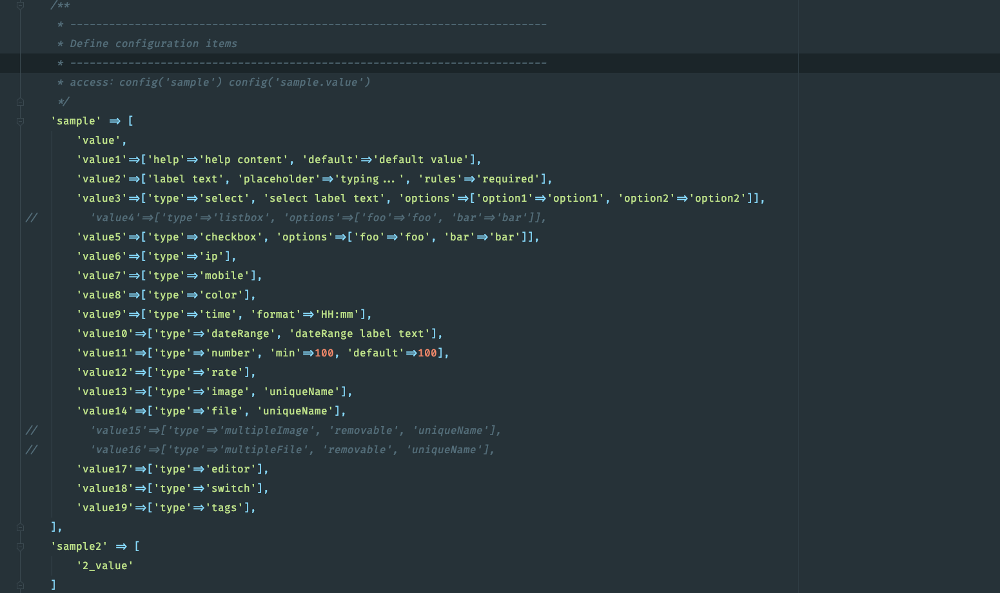
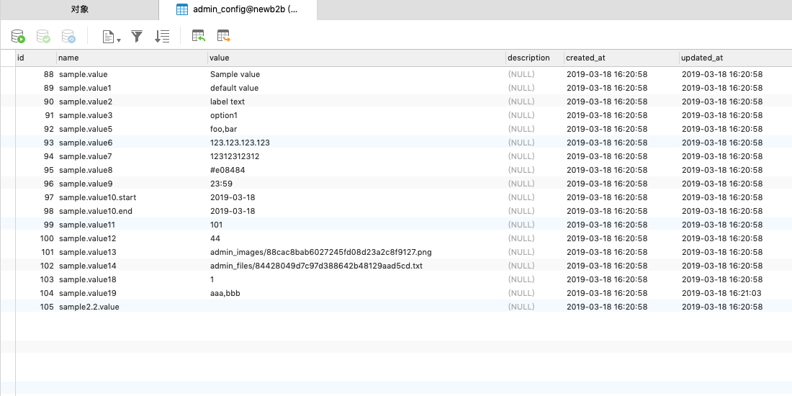

admin-config
======

基于[laravel-admin](https://github.com/z-song/laravel-admin)的数据库配置管理工具，仅通过配置文件就可生成整个表单，支持使用tab页对配置项进行分组


## 使用方法：

第一步：发布配置文件：

```
artisan vendor:publish --tag=admin-config
```

第二步：在配置文件中加入配置组及配置项

第三步：使用config函数


## 效果示例：

配置文件：



生成的表单：


数据库：



使用：

```
// 获取一组
config('sample')
// 获取一项
config('sample.value')
```


